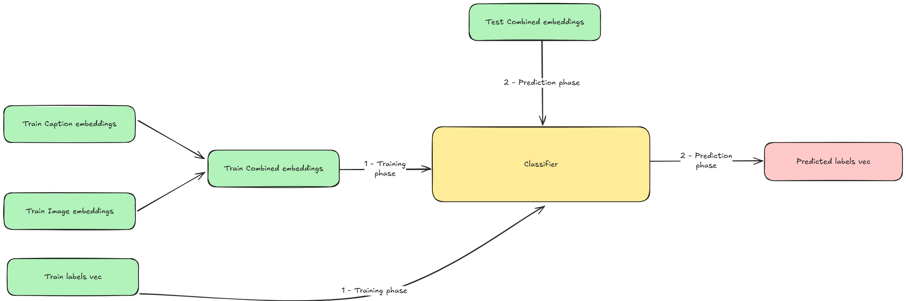

# Multimodal classification that leverages embedding
Machine learning pipeline which aims to classify a multi-label multimodal dataset using early and late fusion with embeddings of the data provided.  
The goal of the project is to train a reliable classificator without the need of fine tune a model, and to verify the effectiveness of the various frozen models.

## Models used for embedding (WIP)
- BERT
- VIT
- openClip

## RocoV2 dataset
The RocoV2 dataset is a multi-label multimodal medical dataset which, for every data, offers a Text+Image pair along with one or more Concept Unique Identifier, or CUI. Every CUI is linked to one or more Semantic Type. To reduce the complexity of the classification, we used the UMLS API to get the semantic type of the 200 most frequent CUIs of the dataset, and used them for our classification purpose. 
We identified 16 Semantic types for our classification:
- 'Body_Location_or_Region',
- 'Disease_or_Syndrome',
- 'Medical_Device',
- 'Acquired_Abnormality',
- 'Body_System',
- 'Qualitative_Concept',
- 'Functional_Concept',
- 'Body_Space_or_Junction',
- 'Tissue',
- 'Neoplastic_Process',
- 'Diagnostic_Procedure',
- 'Body_Substance',
- 'Spatial_Concept',
- 'Body_Part_Organ_or_Organ_Component',
- 'Anatomical_Abnormality',
- 'Pathologic_Function'

The challenge of this dataset, is to train a classifier which takes in consideration the rare labels of the dataset.

## Classification pipeline

The first thing in our pipeline is to transform both the data and their labels, the former in embeddings and the latter in a 16-index-long binary vector, where, $\forall i=0...15$, $vector[i] = 1$ if the element belongs to class $i$, $vector[i] = 0$ viceversa.  

Next, the pipeline splits into two:
- **Early-fusion pipeline**
- **Late-fusione pipeline**

### Early-fusion pipeline

The early-fusion pipeline trains 1 classifier with the merged embeddings of both text and images.

### Late-fusion pipeline (WIP)

## Classifier selection (WIP)